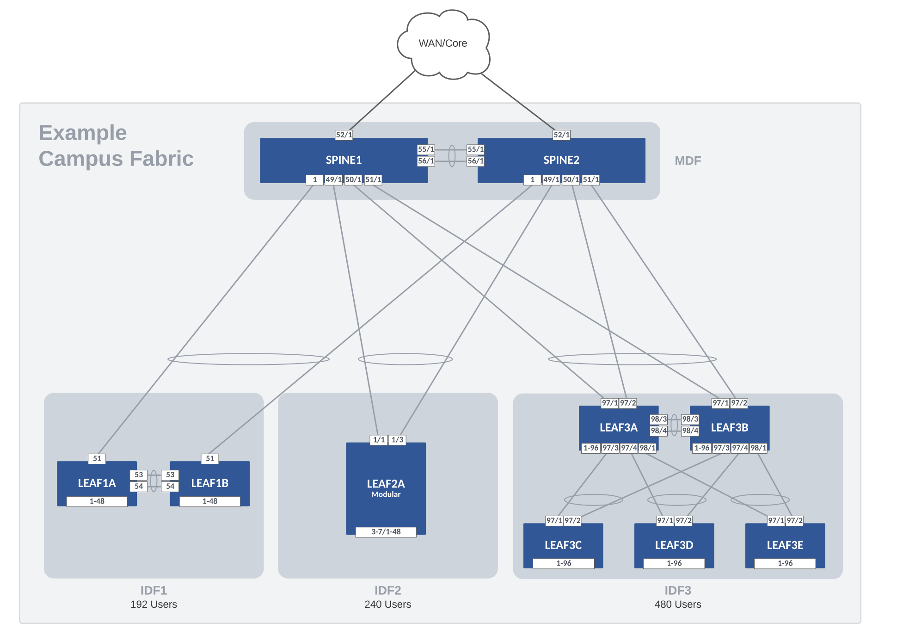

# AVD - L2LS Campus Fabric Demo



## Requirements

- Linux Host
  - Docker and Containerlab installed
  - 8 vCPUs and 32GB RAM (recommended)

## Clone Repo

``` bash
git clone https://github.com/PacketAnglers/avd-l2ls-campus-fabric.git
```

## Start Lab

``` bash
make start-lab
```

You should see something like this:

``` bash
+----+--------+--------------+--------------+------+---------+--------------------+--------------+
| #  |  Name  | Container ID |    Image     | Kind |  State  |    IPv4 Address    | IPv6 Address |
+----+--------+--------------+--------------+------+---------+--------------------+--------------+
|  1 | LEAF1A | 941d984af66c | ceos:4.28.3M | ceos | running | 172.100.100.103/24 | N/A          |
|  2 | LEAF1B | b8a0ccfa8688 | ceos:4.28.3M | ceos | running | 172.100.100.104/24 | N/A          |
|  3 | LEAF2A | 98322340fb52 | ceos:4.28.3M | ceos | running | 172.100.100.105/24 | N/A          |
|  4 | LEAF3A | 28cf73f28f11 | ceos:4.28.3M | ceos | running | 172.100.100.106/24 | N/A          |
|  5 | LEAF3B | 64b118acf67c | ceos:4.28.3M | ceos | running | 172.100.100.107/24 | N/A          |
|  6 | LEAF3C | 055e20e156f4 | ceos:4.28.3M | ceos | running | 172.100.100.108/24 | N/A          |
|  7 | LEAF3D | 577b91ee07a5 | ceos:4.28.3M | ceos | running | 172.100.100.109/24 | N/A          |
|  8 | LEAF3E | 963d1cf9ae52 | ceos:4.28.3M | ceos | running | 172.100.100.110/24 | N/A          |
|  9 | SPINE1 | a2c7fb24c846 | ceos:4.28.3M | ceos | running | 172.100.100.101/24 | N/A          |
| 10 | SPINE2 | fd312eaa81c4 | ceos:4.28.3M | ceos | running | 172.100.100.102/24 | N/A          |
| 11 | WAN1   | ee0ac8154676 | ceos:4.28.3M | ceos | running | 172.100.100.111/24 | N/A          |
| 12 | WAN2   | 0ec907103384 | ceos:4.28.3M | ceos | running | 172.100.100.112/24 | N/A          |
+----+--------+--------------+--------------+------+---------+--------------------+--------------+
```

## Build Configs

``` bash
make build
```

> View the configs and docs generated.  `intended/configs` and `documentation/devices`.

## Deploy Configs - eAPI

``` bash
make deploy
```

## Connect to Switches

Example to connect to a switch with docker exec command.

``` bash
docker exec -it SPINE1 Cli
```

## Add 802.1x Port Configs

- Uncomment network_ports: in DC1_NETWORK_PORTS.yml
- run `make build` again
- show intended/configs

> _You will not be able to deploy the additional ports as they do not exist on the LEAF nodes._

## Stop and Cleanup Lab

``` bash
make stop-lab
```
